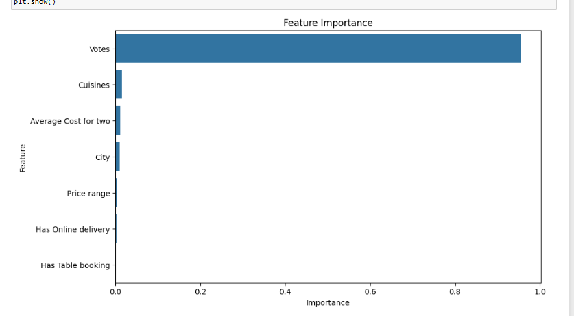
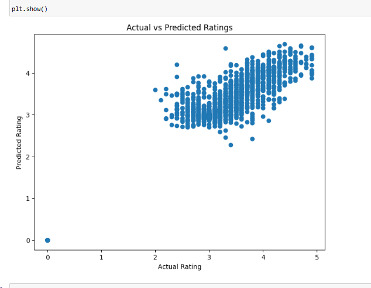
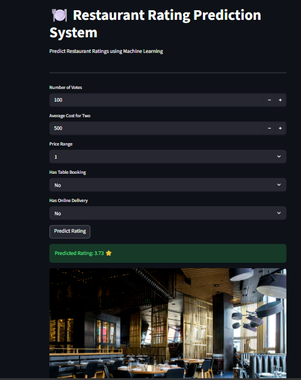

# Restaurant Rating Prediction System

## Overview

This project predicts restaurant ratings using Machine Learning. A Random Forest Regressor model was trained on restaurant data and deployed using Streamlit.

## Features

* Data Cleaning and Preprocessing
* Feature Encoding
* Random Forest Regression Model
* Model Evaluation
* Feature Importance Analysis
* Streamlit Web Application

## Dataset Features

* City
* Cuisines
* Average Cost for Two
* Price Range
* Votes
* Has Table Booking
* Has Online Delivery

## Technologies Used

* Python
* Pandas
* NumPy
* Scikit-Learn
* Matplotlib
* Seaborn
* Streamlit

## Model Performance

| Metric   | Value |
| -------- | ----- |
| MAE      | 0.206 |
| MSE      | 0.102 |
| RMSE     | 0.320 |
| R² Score | 0.955 |

## Screenshots

Add screenshots in the screenshot folder and display them here.

### Feature Importance

### Actual vs Predicted Ratings

### Streamlit Application

## How to Run

Install dependencies:

pip install pandas numpy scikit-learn matplotlib seaborn streamlit

Run application:

streamlit run app.py

## Author

Dharmendra Meena

B.Tech (AI & ML)

JUET Guna

Graduation Year: 2028
