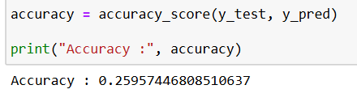
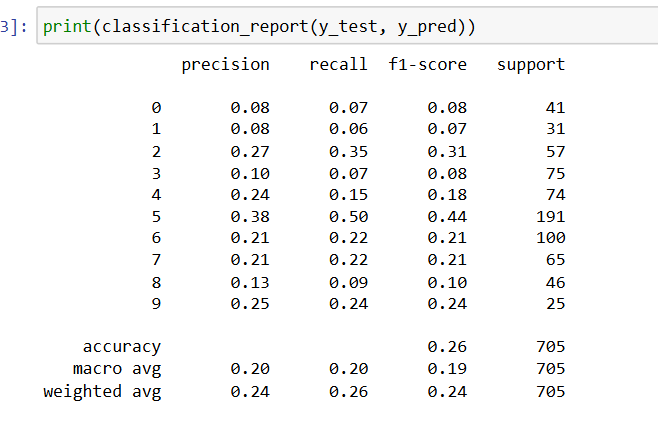
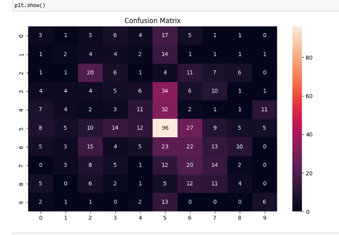
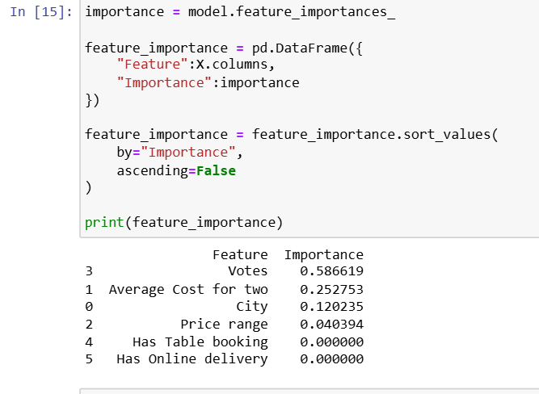

# Cuisine Classification Using Machine Learning

## Overview

This project develops a Machine Learning model to classify restaurants based on their cuisine type using restaurant-related features.

## Project Workflow

1. Data Collection
2. Data Cleaning
3. Missing Value Handling
4. Label Encoding
5. Train-Test Split
6. Random Forest Classification
7. Model Evaluation
8. Performance Analysis

## Features Used

* City
* Average Cost for Two
* Price Range
* Votes
* Aggregate Rating
* Has Table Booking
* Has Online Delivery

## Target Variable

* Cuisine Type

## Technologies Used

* Python
* Pandas
* NumPy
* Scikit-Learn
* Matplotlib
* Seaborn
* Jupyter Notebook

## Machine Learning Algorithm

Random Forest Classifier

## Evaluation Metrics

* Accuracy
* Precision
* Recall
* F1 Score
* Confusion Matrix

## Results

Accuracy Achieved: 25.96%

### Challenges

* Multiple cuisine combinations
* Class imbalance
* Similar cuisine characteristics

### Key Insights

* Popular cuisines were predicted more accurately.
* Dataset imbalance affected overall accuracy.
* Additional feature engineering could improve performance.

## Screenshots

### Accuracy Output

### Classification Report

### Confusion Matrix

### Feature Importance

## Project Structure

Task3_CuisineClassification/

├── cuisine_classification.ipynb

├── README.md

├── screenshots/

│ ├── accuracy.png

│ ├── classification_report.png

│ ├── confusion_matrix.png

│ └── feature_importance.png

## Author

Dharmendra Meena

B.Tech (Artificial Intelligence & Machine Learning)

JUET Guna

Graduation Year: 2028
